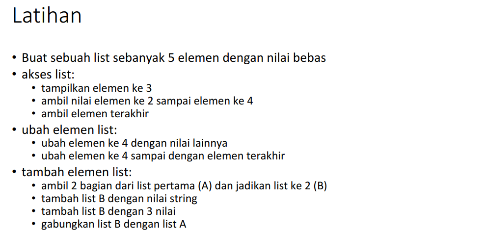
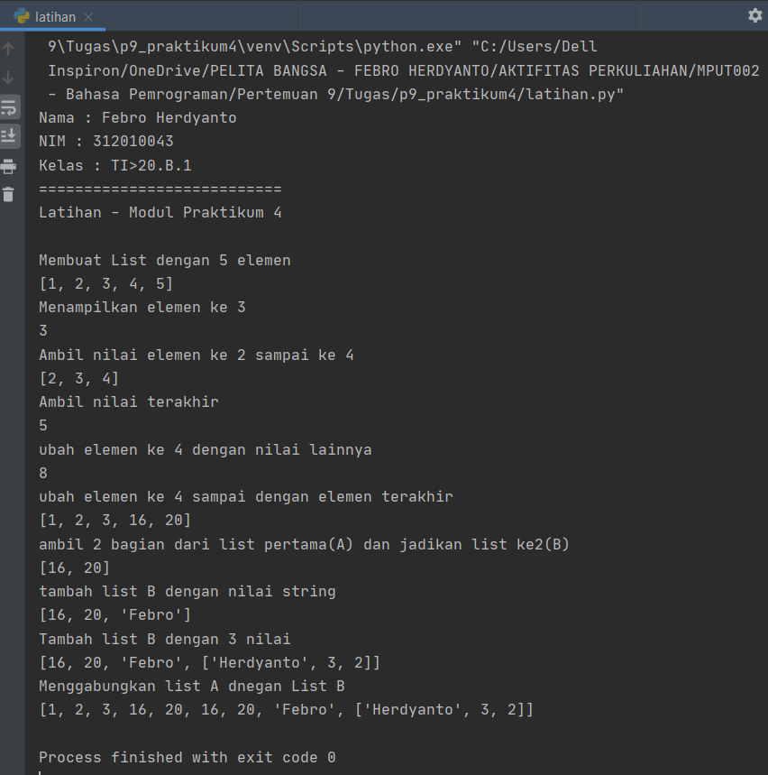
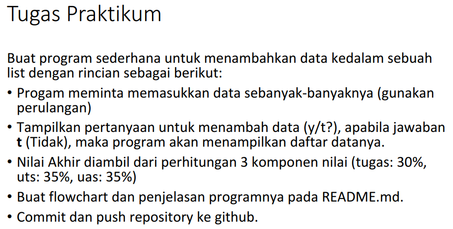
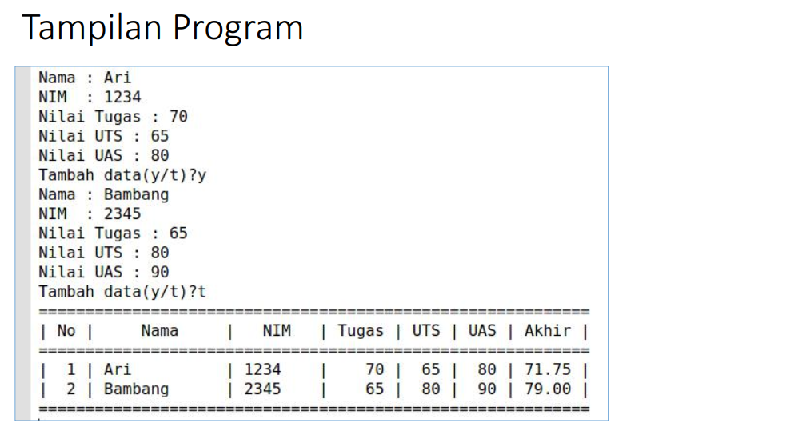
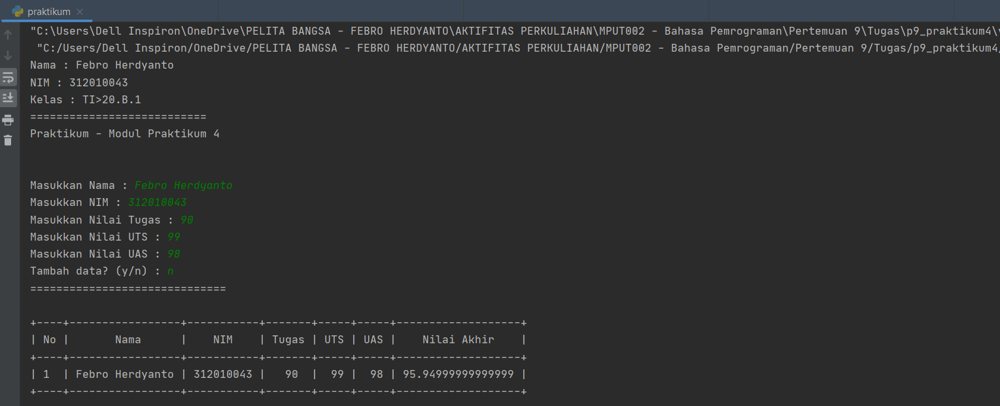
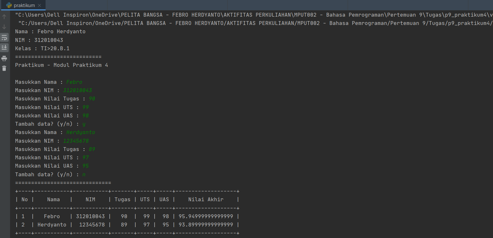

# Pertemuan 9 - Praktikum 4 (*repo : p9_praktikum4*)
Tugas Pertemuan 9 - Praktikum 4 (Bahasa Pemrograman)
<hr>

= Nama  : Febro Herdyanto<br>
= NIM   : 312010043<br>
= Kelas : TI.20.B.1<br>

Pada mata kuliah Bahasa Pemrograman - Pertemuan 9 kali ini saya mendapatkan materi *List, Tuple dan Dictionary*.<br>
Nah, untuk praktikum 4 ini materi yang didapatkan adalah **List**.<br>
<br>
* Didalam materi praktikum 4 ini terdapat 2 tugas. Yaitu : Latihan dan Praktikum.<br>

## Praktikum 4 - Praktikum

* Berikut adalah tugas dari Latihan, bisa dilihat pada gambar dibawah ini :<br>
<br>
* Berikut jawaban / *source code* / program sederhana yang telah saya buat :
``` python
print("Nama : Febro Herdyanto")
print("NIM : 312010043")
print("Kelas : TI>20.B.1")
print("===========================")
print("Latihan - Modul Praktikum 4")
print()

print("Membuat List dengan 5 elemen")
daftar = [1, 2, 3, 4, 5]
print(daftar)
# Akses List
print("Menampilkan elemen ke 3")
print(daftar[2])

print("Ambil nilai elemen ke 2 sampai ke 4")
print(daftar[1:4])

print("Ambil nilai terakhir")
print(daftar[-1])

# Ubah element list
print("ubah elemen ke 4 dengan nilai lainnya")
daftar[3] = 8
print(daftar[3])

print("ubah elemen ke 4 sampai dengan elemen terakhir")
daftar[3:5] = [16, 20]
print(daftar)

# Tambah Element List
print("ambil 2 bagian dari list pertama(A) dan jadikan list ke2(B)")
baris = daftar[3:5]
print(baris)

print("tambah list B dengan nilai string")
baris.append("Febro")
print(baris)

print("Tambah list B dengan 3 nilai")
baris.append(["Herdyanto", 3, 2])
print(baris)

print("Menggabungkan list A dnegan List B")
gabung = daftar + baris
print(gabung)
```

* Untuk hasil dari source code tersebut adalah seperti berikut : <br>
<br>

Nah seperti itulah hasil dari program Latihan yang diberikan oleh dosen.<br>
<hr>

## Praktikum 4 - Praktikum

Untuk tugas yang kedua yaitu Tugas Praktikum, yaitu tugas untuk membuat program sederhana menampilkan Data Nilai Mahasiswa.<br>
* Berikut soal yang diberikan oleh dosen :<br>
<br>

* Hasil yang di harapkan oleh dosen adalah seperti berikut :<br>
<br>

* Selain membaca dan memahami materi yang diberikan oleh Dosen, saya juga mencari referensi dari Google dan Forum Pemrograman yang ada di Internet. Pada akhirnya saya bisa membuat program yang diberikan oleh dosen.

* Berikut source code yang telah saya temukan untuk membuat program sederhana Data Nilai Mahasiswa :<br>
``` python
from prettytable import PrettyTable

print("Nama : Febro Herdyanto")
print("NIM : 312010043")
print("Kelas : TI>20.B.1")
print("===========================")
print("Praktikum - Modul Praktikum 4")
print()

daftar = []
stop = False

# Mengisi Nilai
while not stop:
    nama = input("Masukkan Nama : ")
    nim = input("Masukkan NIM : ")
    tugas = input("Masukkan Nilai Tugas : ")
    uts = input("Masukkan Nilai UTS : ")
    uas = input("Masukkan Nilai UAS : ")
    nilai_akhir = 0.3 * float(tugas) + 0.35 * float(uts) + 0.35 * float(uas)
    daftar.append([nama, nim, tugas, uts, uas, nilai_akhir])

    tanya = input("Tambah data? (y/n) : ")
    if tanya == "n":
        stop = True

# Cetak semua nilai
print("==============================")
print()

x = PrettyTable()
i = 0

for data in daftar:
    i += 1
    x.field_names = ["No", "Nama", "NIM", "Tugas", "UTS", "UAS", "Nilai Akhir"]
    x.add_row([i, data[0], data[1], data[2], data[3], data[4], data[5]])
print(x)
```

* Didalam source code atau soal tersebut menunjukkan bahwa system harus menampilkan data sebanyak-banyaknya jika user menginputkan Y pada pilihan *Tambah Data?* . Sedangkan hasilnya juga harus sama, menampilkan data sebanyak yang user inputkan. Dan harus terbentuk dalam Table.<br>

* Berikut hasil yang saya dapatkan ketika saya menginputkan 1 data mahasiswa :<br>


* Berikut hasil yang saya dapatkan ketika saya menginputkan 2 atau lebih Data Nilai Mahasiswa :<br>


* Saya akan menjelaskan secara singkat tentang source code tersebut. <br>
> Saya menggunakan fungsi While untuk mengantur kondisi, seperti While not stop, jadi jika tidak berhenti maka system akan terus menampilkan perintah user untuk menginputkan data mahasiswa<br>
> Penjelasan tersebut atau bisa digunakan ketika kita mengetikan huruf **n** pada peritah : *Tambah Data? (y/n)*<br>
> Untuk perhitungan nilai akhir sesuai dengan ketentuan yang dosen inginkan, yatu 30% dari Nilai Tugas, 35% dari Nilai UTS, dan 35% dari Nilai UAS<br>
> Sedangkan untuk menampilkan hasil dari inputan user tersebut saya menggunakan fungsi atau modul dari *PrettyTable()*,

* Untuk menggunakan module dari Pretty Table, saya harus melakukan beberapa persyaratan yang harus di install. Yaitu : PIP, PrettyTable dan Numpy.<br>

* Langsung saja langkah pertama yang harus di lakukan adalah **Install PIP** di Laptop/PC, dengan mengikuti langkah-langkah dari Link berikut ini [How to Intsall PIP on Windows](https://phoenixnap.com/kb/install-pip-windows) .<br>
Didalam link tersebut terdapat langkah-langkah yang sangat detail, silahkan ikuti step by step nya.<br>

* Setelah PIP dan Python berhasil di install, langkah kedua adalah melakukan installasi PrettyTable tersebut. Dengan mengikuti langkah-langkah dari Link berikut ini : [How to install PrettyTable on Python](https://pypi.org/project/prettytable/) <br>
Didalam situs tersebut terdapat cara-cara installasi prettytable dan cara menggunakannya.<br>

* Setelah PIP dan Pretty Table selesai di install, langkah terkahir adalah melakukan installasi *Numpy*. Langkah ini perlu dilakukan apabila kita mengalami error saat mencoba running aplikasi python menggunakan prettytable.<br>
Error yang dimaksud adalah seperti berikut ini : *ModuleNotFoundError: No module named 'PrettyTable'*<br>
Jika terdapat error seperti diatas maka harus melakukan instalasi numpy, dengan langkah-langkah yang ada di Link berikut ini : [How to install Numpy](https://stackoverflow.com/questions/60496280/python-error-modulenotfounderror-no-module-named-modulename/60496306#60496306?newreg=38536a77f74f40a691560e099363f4c3) <br>
<hr>

Seperti diataslah tugas yang telah saya buat. Terima kasih.<br>
### Febro Herdyanto - 312010043 - TI.20.B1